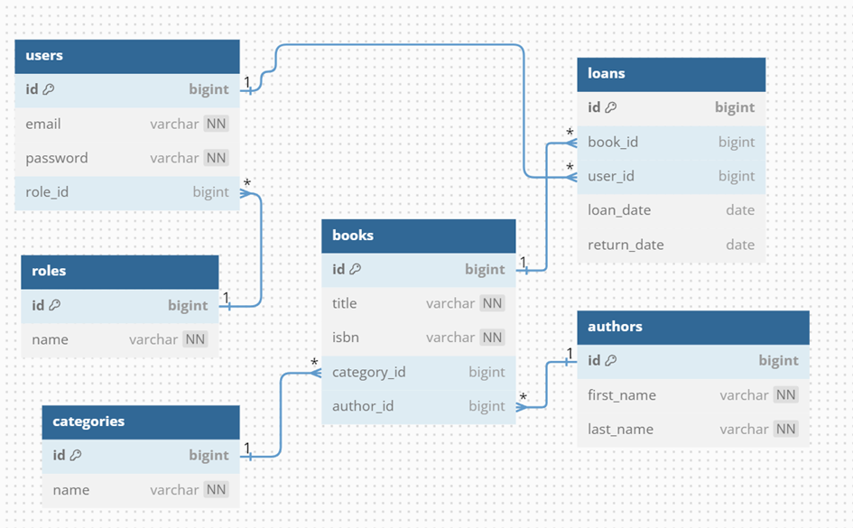

# System zarządzania biblioteką

## Cel aplikacji
Aplikacja ma na celu uproszczenie zarządzania księgozbiorem, czytelnikami oraz procesami wypożyczeń w bibliotece. Oferuje narzędzia do organizacji danych, takich jak zarządzanie zasobami książek, rejestracja wypożyczeń i zwrotów oraz zapewnienie bezpieczeństwa danych poprzez zdefiniowanie poziomów dostępu użytkowników. System eliminuje błędy ręcznego zarządzania danymi, umożliwia szybkie wyszukiwanie informacji i usprawnia codzienną pracę personelu biblioteki.

---

## Rodzaje użytkowników

### 1. Administratorzy
- Zarządzanie zasobami (dodawanie, edytowanie, usuwanie książek, czytelników, pracowników, autorów).
- Definiowanie i zarządzanie poziomami dostępu do systemu.
- Generowanie raportów dotyczących książek, wypożyczeń oraz użytkowników.
- Ustawianie haseł oraz zarządzanie kontami pracowników.

### 2. Pracownicy
- Obsługa wypożyczeń i zwrotów książek.
- Wprowadzanie nowych książek i autorów.
- Przeglądanie i filtrowanie danych (np. lista książek dostępnych w bibliotece, historia wypożyczeń czytelnika).

### 3. Czytelnicy
- Dane o czytelnikach są rejestrowane przez pracowników, ale sami czytelnicy nie wchodzą w bezpośrednią interakcję z aplikacją. System może zawierać funkcjonalność przeglądu historii wypożyczeń przez pracowników na życzenie czytelników.

---

## Wymagania funkcjonalne

### Administrator:
1. Dodawanie, edytowanie i usuwanie rekordów (książek, czytelników, pracowników, autorów).
2. Zarządzanie poziomami dostępu w systemie.
3. Generowanie raportów dotyczących aktywności w systemie.

### Pracownik:
1. Obsługa wypożyczeń i zwrotów książek.
2. Wprowadzanie nowych książek i autorów.
3. Przeglądanie danych z możliwością filtrowania według różnych kryteriów (np. kategoria książek, autor).

---

## Modelowanie logiczne

Wyodrębniono następujące encje:

### Encje i ich pola:
1. **users (Użytkownik):**
   - ID (klucz podstawowy)
   - Imię
   - Nazwisko
   - Email
   - Hasło
   - Rola (odniesienie do tabeli Role)

2. **books (Książka):**
   - ID (klucz podstawowy)
   - ISBN
   - Tytuł
   - Liczba egzemplarzy
   - Kategoria (odniesienie do tabeli Category)
   - Autor (odniesienie do tabeli Author)

3. **loans (Wypożyczenie):**
   - ID (klucz podstawowy)
   - ID użytkownika (klucz obcy do User.ID)
   - ID książki (klucz obcy do Book.ID)
   - Data wypożyczenia
   - Data zwrotu
   - Status (np. "wypożyczona", "zwrócona")

4. **roles (Rola użytkownika):**
   - ID (klucz podstawowy)
   - Nazwa roli (np. Administrator, Pracownik)

5. **authors (Autor):**
   - ID (klucz podstawowy)
   - Imię
   - Nazwisko

6. **categories (Kategoria książki):**
   - ID (klucz podstawowy)
   - Nazwa kategorii

---

### Diagram ER:

---

## Normalizacja

### Proces normalizacji:
Baza danych została znormalizowana do 3NF:
- **1NF:** Wszystkie atrybuty zawierają wyłącznie atomowe wartości.
- **2NF:** Wszystkie dane są zależne od całego klucza podstawowego (np. informacje o autorze są trzymane w osobnej tabeli Author).
- **3NF:** Usunięto zależności przechodnie (np. nazwa autora nie jest przechowywana w tabeli Book, lecz jest odczytywana z tabeli Author).

### Dane redundantne:
Nie przechowujemy danych redundantnych. W przypadku ewentualnych optymalizacji (np. cache'owanie wyników dla szybszego dostępu), takie zmiany zostaną opisane i uzasadnione w przyszłości.

---

## Klucze i dostępy

### Klucze kandydackie:
1. **users:** (email), (ID).
2. **books:** (ISBN), (ID).

### Klucze podstawowe:
- ID w każdej tabeli.

### Klucze obce:
- W tabeli loans:
  - `user_id` odnosi się do `users.ID`.
  - `book_id` odnosi się do `books.ID`.
- W tabeli books:
  - `author_id` odnosi się do `authors.ID`.
  - `category_id` odnosi się do `categories.ID`.
- W tabeli users:
  - `role_id` odnosi się do `roles.ID

### Poziomy dostępu:
1. **Administratorzy:**
   - Pełny dostęp do wszystkich tabel (możliwość edycji, usuwania, dodawania danych).
   - Dostęp do logów systemu oraz generowania raportów.

2. **Pracownicy:**
   - Dostęp do tabel Loan, Book, User z ograniczonymi prawami edycji (np. brak możliwości usuwania użytkowników).
   - Brak dostępu do zarządzania poziomami dostępu innych użytkowników.

---

## Planowane funkcje, procedury i triggery

### Procedury:
1. Automatyczne dodawanie nowej kategorii w tabeli Category, jeśli kategoria podana przy dodawaniu książki nie istnieje.
2. Generowanie raportów dotyczących wypożyczeń (np. lista najbardziej popularnych książek).

### Funkcje:
1. Wyliczanie liczby dostępnych egzemplarzy książki.
2. Przeszukiwanie danych z uwzględnieniem filtrowania (np. według autora lub kategorii).

### Triggery:
1. Aktualizacja statusu książki w tabeli Book po zwrocie (zmiana statusu na "dostępna").
2. Blokada usunięcia książki, jeśli jest aktualnie wypożyczona.

## Autor:  *Michał Szandarowski*